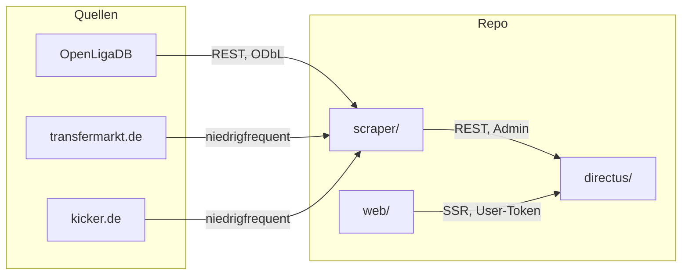

<p align="center">
  
</p>

# Comunio Assistant

Persönliches Werkzeug für Comunio-Entscheidungen in der Bundesliga: **Spielplan und Deadline**, **Marktwert-Katalog**, später **Kader-Check** und **Spieler-Radar**. Comunio stellt keine offizielle API bereit — der eigene Kader wird deshalb manuell gepflegt, Katalog und Spielplan kommen aus öffentlichen Quellen.

Repo auf GitHub: [`schroepa/comunio-skrt`](https://github.com/schroepa/comunio-skrt). Invite-only Login, getrennte Kader.

## Stand

| Bereich | Status |
|---|---|
| Directus-Schema (Player, Fixture, Kader inkl. `user_id`, Rivalen, …) | da |
| Spielplan über OpenLigaDB → `Fixture` | da |
| Transfermarkt-Katalog, Marktwerte, Verfügbarkeit → `Player` | da |
| Login + eigener Kader (`/kader`) | da |
| Radar, Kader-Check, Konkurrenz, Aufstellung | da (Noten brauchen `sync:kicker`) |
| Kicker-Noten | CLI `npm run sync:kicker` |
| Vercel-Cron, CSV-Fallback | noch nicht |

## Architektur



- **`web/`** — Astro 7, React-Islands, Tailwind, shadcn/ui. Session-Cookie, Directus nur serverseitig.
- **`directus/`** — SQLite (Docker), self-hosted. Rolle `manager` für App-User.
- **`scraper/`** — CLI, Admin-Login. OpenLigaDB, Transfermarkt, Kicker.

## Schnellstart

Voraussetzung: Node.js 22.19+, Docker.

```bash
# 1. Directus
cd directus
cp .env.example .env   # SECRET, ADMIN_EMAIL, ADMIN_PASSWORD setzen
docker compose up -d
docker compose exec directus npx directus schema apply --yes ./schema/snapshot.yaml
node --env-file=.env scripts/ensure-manager-role.mjs

# 2. Daten holen
cd ../scraper
cp .env.example .env   # DIRECTUS_EMAIL / DIRECTUS_PASSWORD aus directus/.env
npm install
npm run sync:openligadb
npm run sync:transfermarkt

# 3. UI
cd ../web
cp .env.example .env   # DIRECTUS_URL
npm install
npm run dev            # http://localhost:4321 → /login
```

User in Directus anlegen, Rolle **manager**. Kein Static Token für die App.

Details: [`directus/README.md`](directus/README.md), [`scraper/README.md`](scraper/README.md), [`web/README.md`](web/README.md).

## Datenmodell

| Collection | Zweck | Pflege |
|---|---|---|
| `Player` | Katalog: Name, Position, Verein, Marktwert, `transfermarkt_id` | Scraper |
| `ValueHistory` | Marktwert über die Zeit | Scraper |
| `RatingHistory` | Kicker-Note, Minuten | folgt (kicker) |
| `Fixture` | Spieltag, Teams, Kickoff | Scraper (OpenLigaDB) |
| `AvailabilityStatus` | fit / fraglich / verletzt / gesperrt je Spieltag | Scraper |
| `SquadMembership` | eigener Kader, Kaufpreis | **immer manuell** |
| `CompetitorSquad` | 2–3 Liga-Rivalen | manuell, später |
| `ScrapeLog` | Erfolg/Fehler je Quelle | Scraper |

## Datenquellen

| Daten | Quelle | Zugang |
|---|---|---|
| Spielplan | [OpenLigaDB](https://www.openligadb.de/) | REST/JSON, [ODbL](https://opendatacommons.org/licenses/odbl/) — Namensnennung im Footer |
| Katalog, Marktwerte, Verfügbarkeit | transfermarkt.de | öffentlich sichtbar, kein API; private, niedrigfrequente Nutzung. Bei HTTP 403 abbrechen, Sperre nicht umgehen, auf CSV wechseln |
| Noten | kicker.de | folgt |
| Eigener Kader | — | Comunio gibt ihn nicht heraus |

Kein rechtlicher Rat. Transfermarkt-ToS (§11.1) untersagt Scraping; das ist eine bewusste, private Entscheidung für dieses Ein-Personen-Tool.

## Roadmap

**V1 — Fehler vermeiden**

1. Datenpipeline (Phase 1–3 erledigt: Schema, OpenLigaDB, Transfermarkt)
2. Spieler-Radar / Transfermarkt-Analyse — [`docs/spec-transfermarkt.md`](docs/spec-transfermarkt.md)
3. Kader-Check vor der Deadline — [`docs/spec-kader-check.md`](docs/spec-kader-check.md)
4. Dashboard als Klammer — [`docs/spec-dashboard.md`](docs/spec-dashboard.md)

Als Nächstes in der UI: Kader-Picker (Suche in `Player`, Schreiben von `SquadMembership`), danach Radar an den Katalog anschließen. Formscore braucht Kicker-Noten.

**V1.5** Konkurrenz-Vergleich (leicht). **V2** Aufstellung, Punkteprognose, voller Konkurrenz-Vergleich.

### Nicht in V1

Kein Multi-User, keine Comunio-Login-Anbindung, keine Punkteprognose, keine automatische Aufstellungsoptimierung.

## Doku-Index

Produkt-Specs und Implementierungspläne: **[`docs/README.md`](docs/README.md)**. Agent-Kontext: [`CLAUDE.md`](CLAUDE.md).

## Lizenz

Persönliches Tool, derzeit ohne Open-Source-Lizenz (Standard-Urheberrecht). Kein Contributor-Aufruf.
