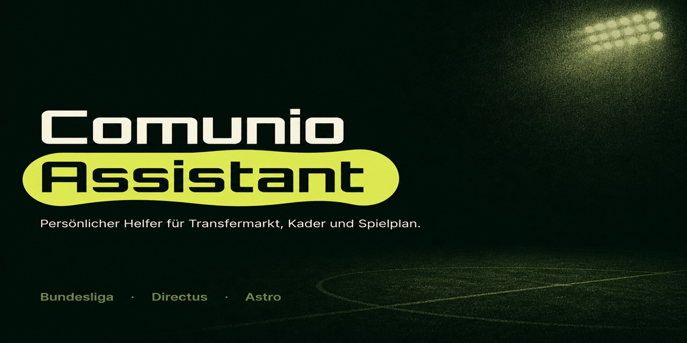
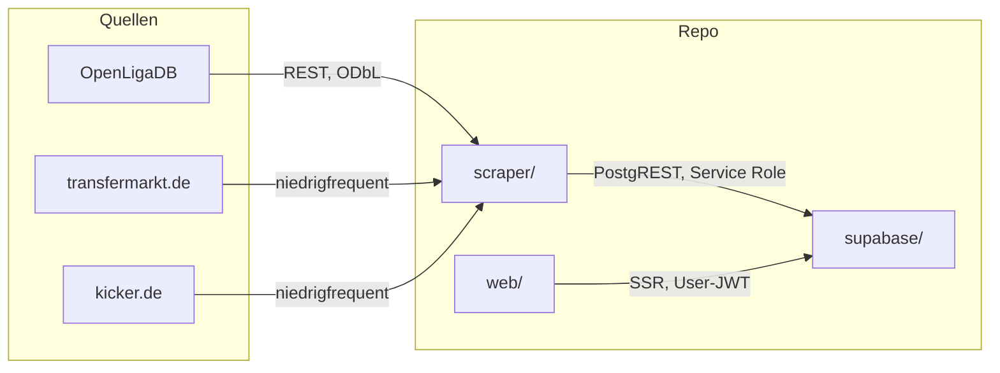

<p align="center">
  
</p>

# Comunio Assistant

Persönliches Werkzeug für Comunio-Entscheidungen in der Bundesliga: **Spielplan und Deadline**, **Marktwert-Katalog**, später **Kader-Check** und **Spieler-Radar**. Comunio stellt keine offizielle API bereit — der eigene Kader wird deshalb manuell gepflegt, Katalog und Spielplan kommen aus öffentlichen Quellen.

Repo auf GitHub: [`schroepa/comunio-skrt`](https://github.com/schroepa/comunio-skrt). Invite-only Login, getrennte Kader.

## Stand

| Bereich | Status |
|---|---|
| Supabase-Schema (player, fixture, Kader inkl. `user_id`, Rivalen, RLS) | SQL im Repo |
| Spielplan über OpenLigaDB → `Fixture` | da |
| Transfermarkt-Katalog, Marktwerte, Verfügbarkeit → `Player` | da |
| Login + eigener Kader (`/kader`) | da |
| Radar, Kader-Check, Konkurrenz, Aufstellung | da (Noten brauchen `sync:kicker`) |
| Kicker-Noten | CLI `npm run sync:kicker` |
| Vercel-Cron, CSV-Fallback | noch nicht |

## Architektur



- **`web/`** — Astro 7, React-Islands, Tailwind, shadcn/ui. Session-Cookie, Supabase nur serverseitig (`SUPABASE_URL`, `SUPABASE_ANON_KEY`).
- **`supabase/`** — SQL-Migration + RLS. Projekt legst du im Dashboard an.
- **`scraper/`** — CLI, Service Role. OpenLigaDB, Transfermarkt, Kicker.
- **`directus/`** — alt, nicht mehr der Happy Path.

## Schnellstart

Voraussetzung: Node.js 22.19+. Supabase-Projekt siehe [`supabase/README.md`](supabase/README.md).

```bash
# 1. SQL aus supabase/migrations/ im SQL Editor ausführen, User einladen

# 2. Daten holen
cd scraper
cp .env.example .env   # SUPABASE_URL + SUPABASE_SERVICE_ROLE_KEY
npm install
npm run sync:openligadb
npm run sync:transfermarkt

# 3. UI
cd ../web
cp .env.example .env   # SUPABASE_URL + SUPABASE_ANON_KEY
npm install
npm run dev            # http://localhost:4321 → /login
```

Kein Service Role in der Web-App oder auf Vercel.

Details: [`supabase/README.md`](supabase/README.md), [`scraper/README.md`](scraper/README.md), [`web/README.md`](web/README.md).

## Datenmodell

| Tabelle | Zweck | Pflege |
|---|---|---|
| `player` | Katalog: Name, Position, Verein, Marktwert, `transfermarkt_id` | Scraper |
| `value_history` | Marktwert über die Zeit | Scraper |
| `rating_history` | Kicker-Note, Minuten | Scraper (`sync:kicker`) |
| `fixture` | Spieltag, Teams, Kickoff | Scraper (OpenLigaDB) |
| `availability_status` | fit / fraglich / verletzt / gesperrt je Spieltag | Scraper |
| `squad_membership` | eigener Kader, Kaufpreis | **immer manuell** |
| `competitor_squad` | 2–3 Liga-Rivalen | manuell |
| `scrape_log` | Erfolg/Fehler je Quelle | Scraper |

## Datenquellen

| Daten | Quelle | Zugang |
|---|---|---|
| Spielplan | [OpenLigaDB](https://www.openligadb.de/) | REST/JSON, [ODbL](https://opendatacommons.org/licenses/odbl/) — Namensnennung im Footer |
| Katalog, Marktwerte, Verfügbarkeit | transfermarkt.de | öffentlich sichtbar, kein API; private, niedrigfrequente Nutzung. Bei HTTP 403 abbrechen, Sperre nicht umgehen, auf CSV wechseln |
| Noten | kicker.de | folgt |
| Eigener Kader | — | Comunio gibt ihn nicht heraus |

Kein rechtlicher Rat. Transfermarkt-ToS (§11.1) untersagt Scraping; das ist eine bewusste, private Entscheidung für dieses Ein-Personen-Tool.

## Roadmap

**V1 — Fehler vermeiden**

1. Datenpipeline (Phase 1–3 erledigt: Schema, OpenLigaDB, Transfermarkt)
2. Spieler-Radar / Transfermarkt-Analyse — [`docs/spec-transfermarkt.md`](docs/spec-transfermarkt.md)
3. Kader-Check vor der Deadline — [`docs/spec-kader-check.md`](docs/spec-kader-check.md)
4. Dashboard als Klammer — [`docs/spec-dashboard.md`](docs/spec-dashboard.md)

**V1.5** Konkurrenz-Vergleich (leicht). **V2** Aufstellung, Punkteprognose, voller Konkurrenz-Vergleich.

### Nicht in V1

Keine öffentliche Registrierung, keine Comunio-Login-Anbindung.

## Doku-Index

Produkt-Specs und Implementierungspläne: **[`docs/README.md`](docs/README.md)**. Agent-Kontext: [`CLAUDE.md`](CLAUDE.md).

## Lizenz

Persönliches Tool, derzeit ohne Open-Source-Lizenz (Standard-Urheberrecht). Kein Contributor-Aufruf.
